# Laporan Praktikum Pemrograman Mobile Pertemuan 3 #

### Pengenalan Core Component dan Styling ###

## 🎯 Tujuan Pembelajaran

Setelah menyelesaikan praktikum ini, mahasiswa mampu:

1. Memahami dan menggunakan **16 Core Components** React Native
2. Menerapkan **StyleSheet** untuk styling terpusat
3. Menggunakan **useState** untuk state management dasar
4. Membuat layout yang responsif dengan **Flexbox**
5. Menangani **interaksi pengguna** (tekan, input, scroll)

## Langkah 1 : Import dan Struktur Dasar

1. Membuka file `App.js` pada folder proyek `ptmn2`.
2. Mengimpor komponen yang diperlukan dari `react-native`.
3. Menambahkan struktur dasar aplikasi menggunakan komponen `View` dan `Text`.
4. Menjalankan aplikasi untuk memastikan struktur dasar dapat ditampilkan.
5. **Konfirmasi Bukti**
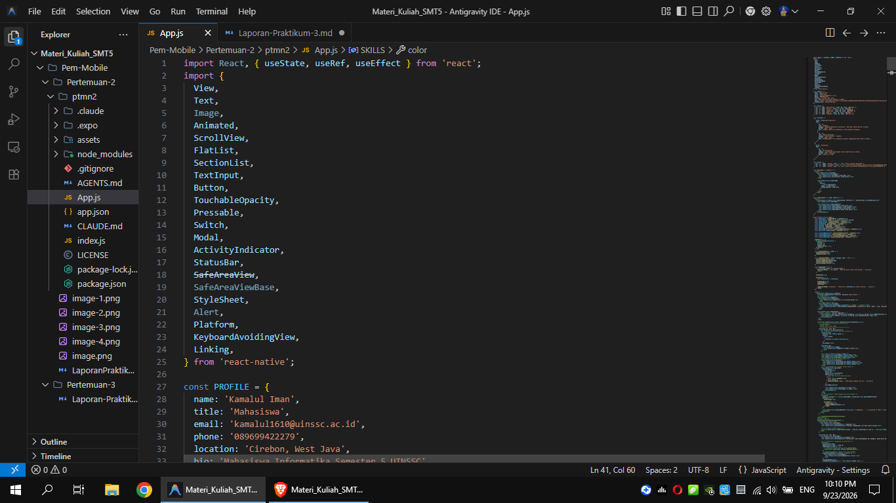

## Langkah 2 : Menyiapkan Data Objek dan Array

1. Membuat objek untuk menyimpan **data profil** pengguna.

2. Membuat array `SKILLS` untuk menyimpan data keterampilan yang dimiliki.

3. Membuat data `SECTIONS` untuk menyimpan riwayat pengalaman dan pendidikan.

4. Membuat data sosial media untuk menampung informasi akun media sosial.

5. Menempatkan data yang bersifat statis di luar fungsi komponen `App()`.

6. **Konfirmasi Bukti Data Profil**
Menampilkan kode objek yang digunakan untuk menyimpan informasi profil.
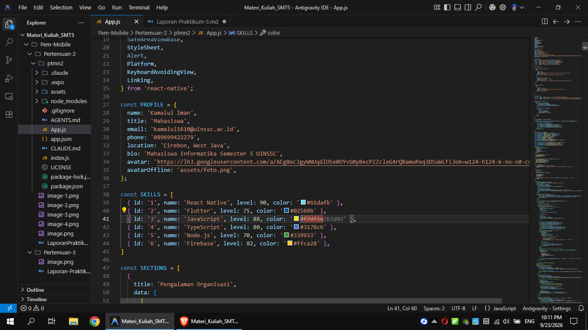

7. **Konfirmasi Bukti Data Skills**
Menampilkan array `SKILLS` yang berisi daftar keterampilan beserta tingkat kemampuan dan warna progress bar.
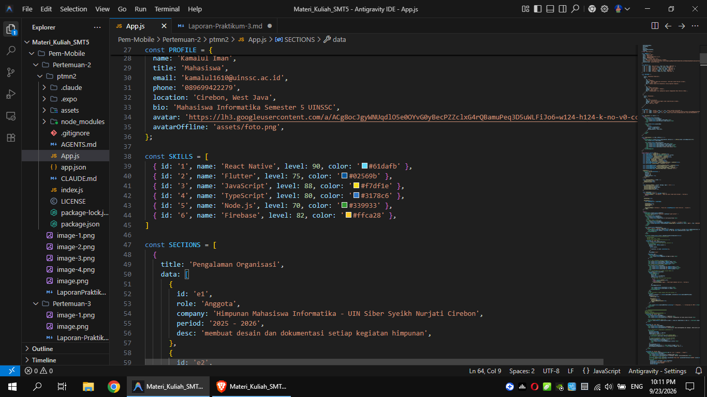

8. **Konfirmasi Bukti Data Sections**
Menampilkan data `SECTIONS` yang digunakan untuk menyimpan riwayat pengalaman dan pendidikan.
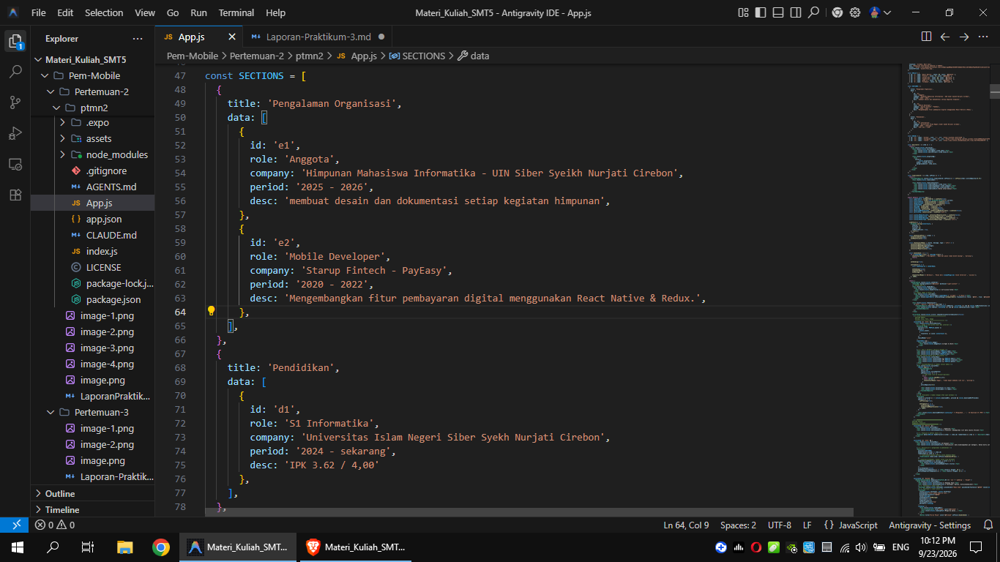

9. **Konfirmasi Bukti Data Sosial Media**
Menampilkan data sosial media yang digunakan pada bagian profil aplikasi.
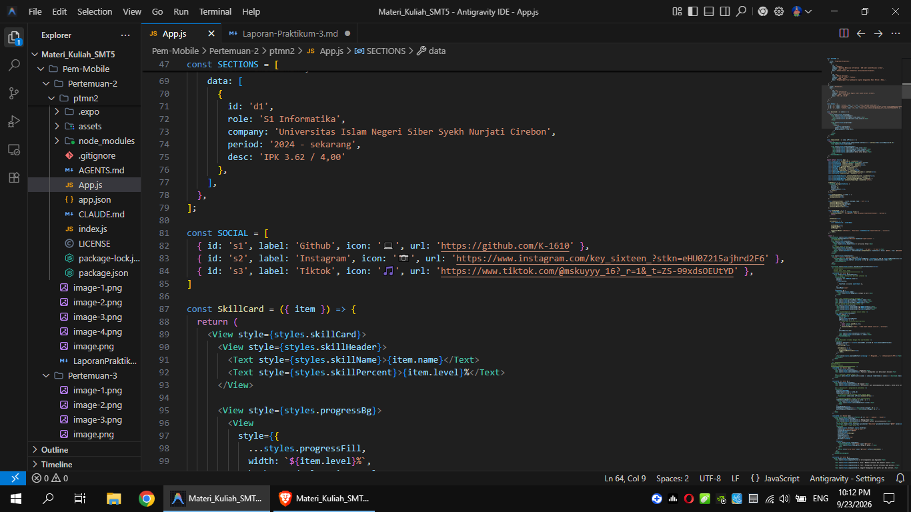

## Langkah 3 : Membuat Sub-Components

1. Membuat komponen `SkillCard` untuk menampilkan satu item data skill.

2. Membuat komponen `TimelineCard` untuk menampilkan satu item data riwayat.

3. Menerapkan konsep **component reuse** pada `SkillCard` dan `TimelineCard`.

4. **Konfirmasi Bukti SkillCard**
Menampilkan kode komponen `SkillCard` yang digunakan untuk menampilkan informasi skill.
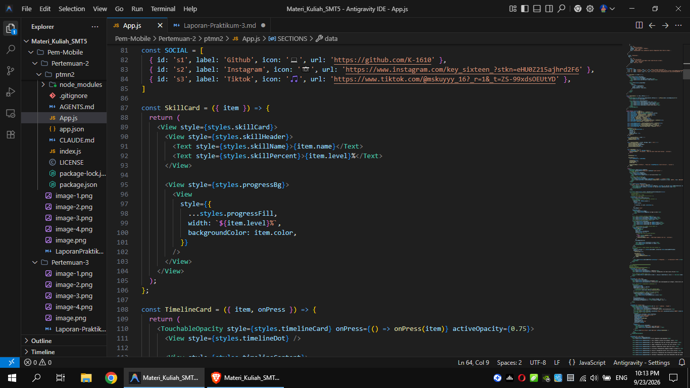

5. **Konfirmasi Bukti TimelineCard**
Menampilkan kode komponen `TimelineCard` yang digunakan untuk menampilkan informasi riwayat.
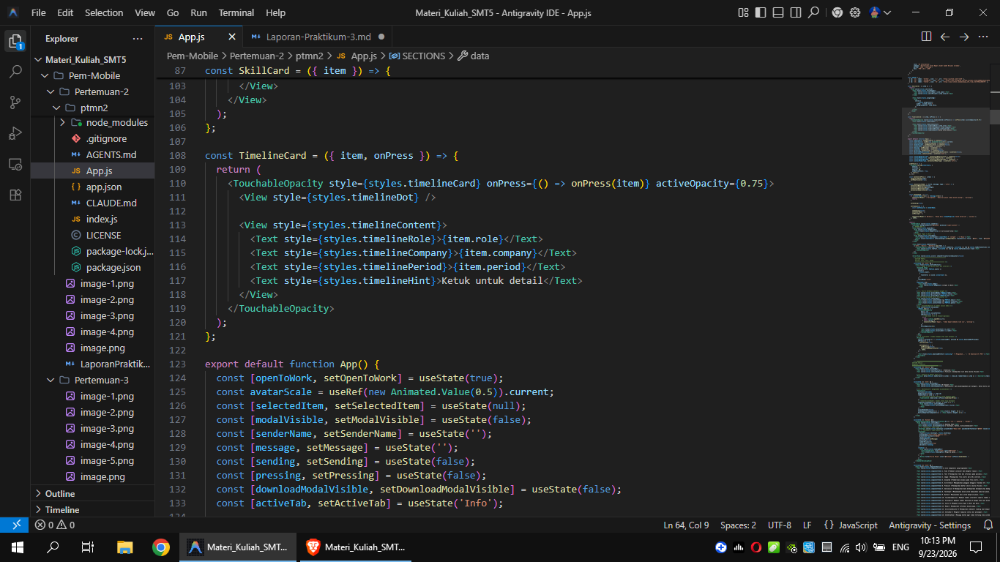

## Langkah 4 : State Management dengan useState

1. Menambahkan `useState` untuk menyimpan data yang dapat berubah pada aplikasi.
2. Membuat state `selectedItem` untuk menyimpan data yang dipilih pengguna.
3. Membuat state `modalVisible` untuk mengatur tampilan modal.
4. Menambahkan state `loading` untuk mengatur status proses loading.
5. **Konfirmasi Bukti**
Menampilkan penggunaan `useState` pada aplikasi.
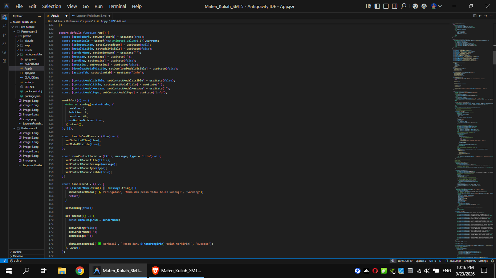

## Langkah 5 : Membuat SafeAreaView, StatusBar, dan Header

1. Menggunakan `SafeAreaView` untuk memastikan tampilan tidak tertutup notch atau home indicator.
2. Menggunakan `StatusBar` untuk mengatur tampilan status bar pada perangkat.
3. Membuat header bar menggunakan `View`.
4. Menambahkan `Switch` pada header untuk mengatur status **Open to Work**.
5. Menggunakan `flexDirection: 'row'` agar elemen pada header tersusun secara horizontal.
6. **Konfirmasi Bukti**
Menampilkan hasil pembuatan header bar yang terdiri dari teks dan `Switch`.
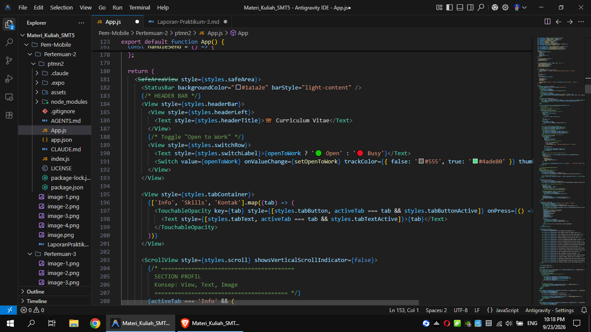

## Langkah 6 : Membuat ScrollView dan Profil Section

1. Membuat `ScrollView` untuk membungkus seluruh konten CV agar dapat di-scroll.
2. Membuat bagian profil menggunakan `View` dan `Text`.
3. Menampilkan foto profil menggunakan `Image` dari URL.
4. Menampilkan nama, jabatan, dan bio pada bagian profil.
5. Membuat tombol media sosial menggunakan `TouchableOpacity` dan `Pressable`.
6. **Konfirmasi Bukti**
Menampilkan hasil profil section yang berisi foto profil, nama, jabatan, bio, serta tombol media sosial.
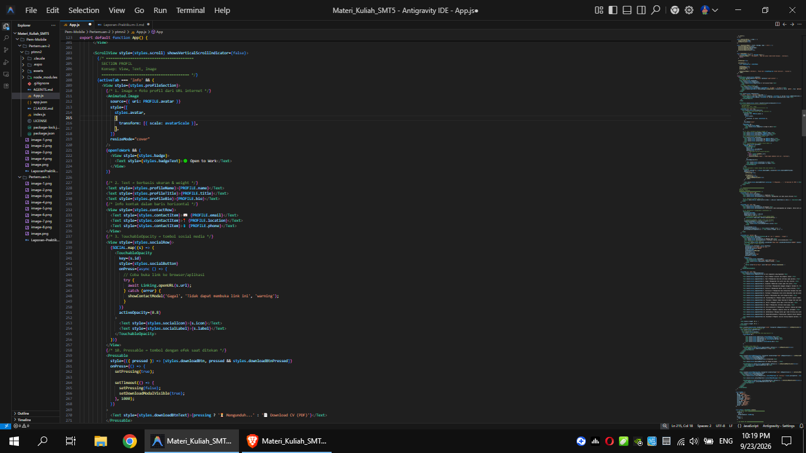

## Langkah 7 : Membuat FlatList untuk Menampilkan Daftar Skills

1. Membuat section skills menggunakan `View` dan `Text`.
2. Menggunakan `FlatList` untuk menampilkan data dari array `SKILLS`.
3. Menggunakan `keyExtractor` untuk memberikan key unik pada setiap item.
4. Menggunakan `renderItem` untuk menampilkan setiap skill melalui komponen `SkillCard`.
5. Menambahkan `ItemSeparatorComponent` sebagai pemisah antar item.
6. Mengatur `scrollEnabled={false}` agar proses scrolling tetap menggunakan `ScrollView` utama.
7. **Konfirmasi Bukti**
Menampilkan daftar skills dalam bentuk kartu dengan progress bar berdasarkan tingkat kemampuan.
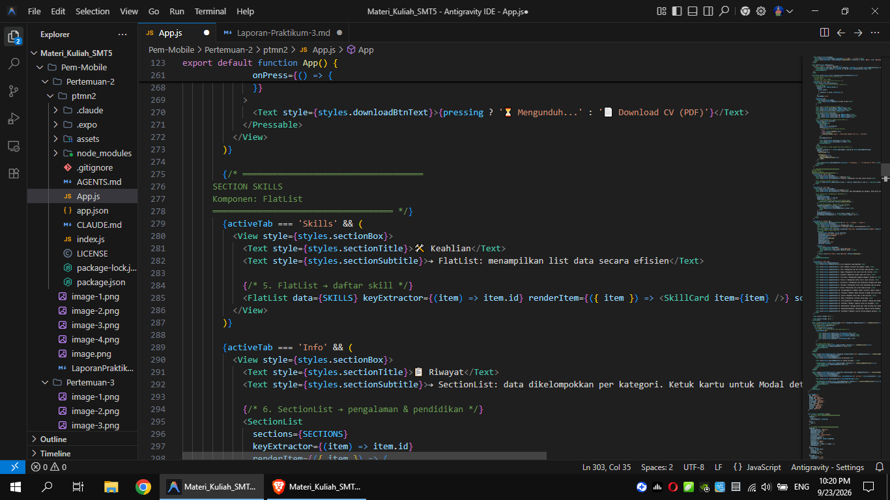

## Langkah 8 : Membuat SectionList untuk Pengalaman dan Pendidikan

1. Membuat section riwayat menggunakan `SectionList`.
2. Menggunakan `SECTIONS` sebagai sumber data yang terdiri dari beberapa kategori.
3. Menggunakan `keyExtractor` untuk memberikan key unik pada setiap item.
4. Menggunakan `renderItem` untuk menampilkan data melalui komponen `TimelineCard`.
5. Menggunakan `renderSectionHeader` untuk menampilkan judul setiap kategori.
6. Menambahkan `ItemSeparatorComponent` sebagai pemisah antar item.
7. **Konfirmasi Bukti**
Menampilkan daftar pengalaman dan pendidikan yang dikelompokkan berdasarkan kategori.
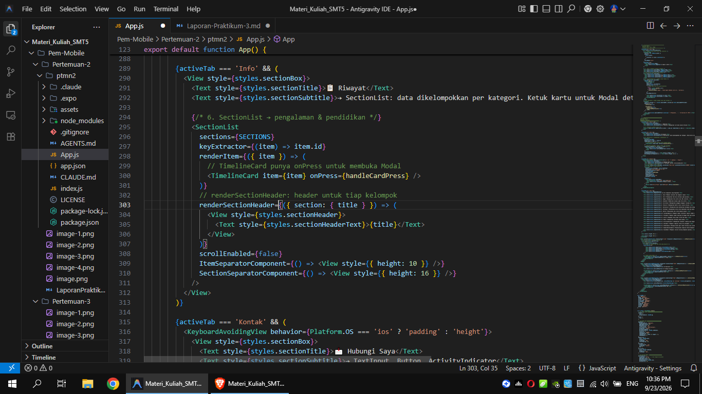

## Langkah 9 : Membuat Form Kontak dengan TextInput, Button, dan ActivityIndicator

1. Membuat section form kontak untuk menerima nama dan pesan dari pengguna.
2. Menggunakan `TextInput` untuk membuat input nama dan pesan.
3. Menghubungkan nilai input dengan state menggunakan `value` dan `onChangeText`.
4. Menambahkan `Button` untuk menjalankan proses pengiriman pesan.
5. Menggunakan `ActivityIndicator` untuk menampilkan indikator loading saat pesan sedang diproses.
6. **Konfirmasi Bukti**
Menampilkan form kontak yang terdiri dari input nama, input pesan, tombol kirim, dan indikator loading.
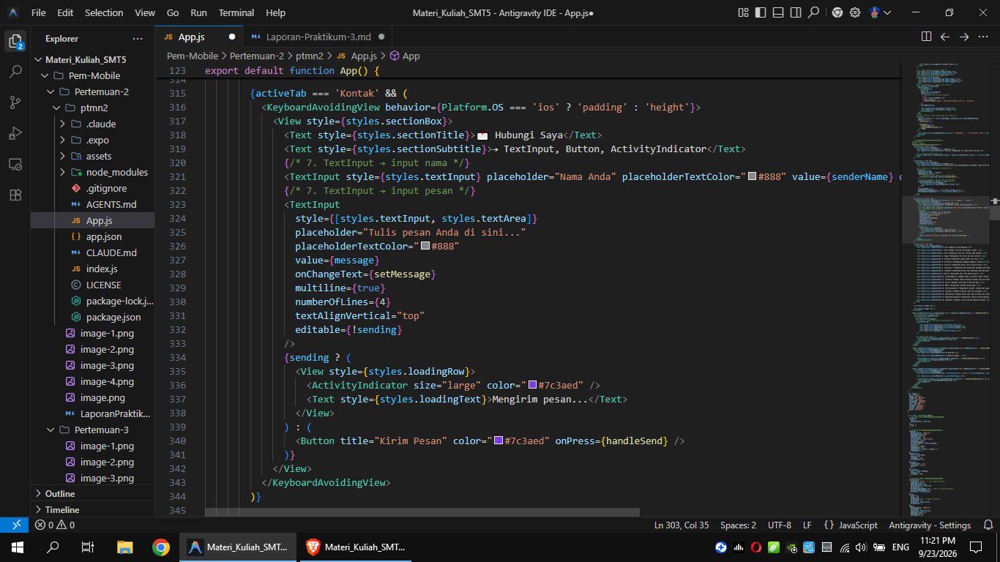

## Langkah 10 : Membuat Modal untuk Detail Riwayat

1. Menambahkan `Modal` untuk menampilkan detail pengalaman atau pendidikan yang dipilih.
2. Mengatur tampilan modal menggunakan prop `visible` berdasarkan state `modalVisible`.
3. Menggunakan `animationType` untuk memberikan animasi saat modal ditampilkan.
4. Mengatur `transparent` agar modal memiliki tampilan overlay di atas halaman.
5. Menampilkan informasi dari `selectedItem` pada modal.
6. Menambahkan tombol **Tutup** untuk menutup modal.
7. **Konfirmasi Bukti**
Menampilkan modal detail riwayat yang muncul ketika kartu pengalaman atau pendidikan dipilih.
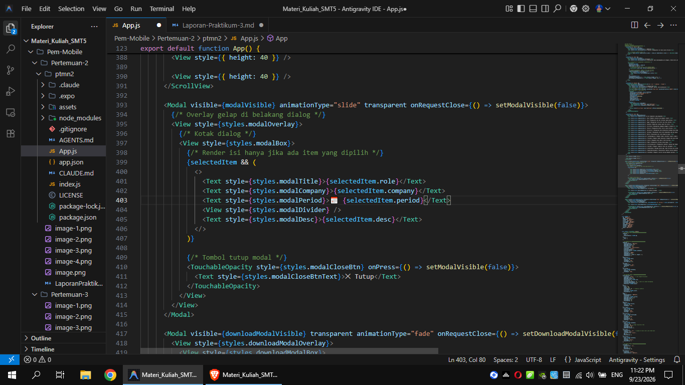

## Langkah 11 : Membuat StyleSheet untuk Styling Terpusat

1. Membuat konstanta palet warna untuk mengatur warna yang digunakan pada aplikasi.
2. Menggunakan `StyleSheet.create()` untuk mengatur seluruh style komponen secara terpusat.
3. Mengatur style untuk berbagai bagian aplikasi, seperti header, profil, sosial media, tombol, section, skill, timeline, form input, loading, dan modal.

### 11.1 Konfirmasi Bukti Palet Warna

Menampilkan konstanta warna yang digunakan sebagai acuan warna pada aplikasi.
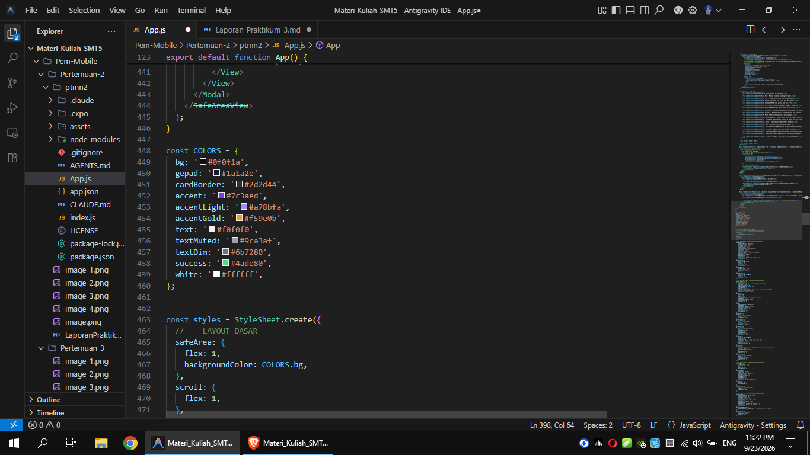

### 11.2 Konfirmasi Bukti StyleSheet Utama

Menampilkan penggunaan `StyleSheet.create()` sebagai tempat pengaturan style aplikasi.
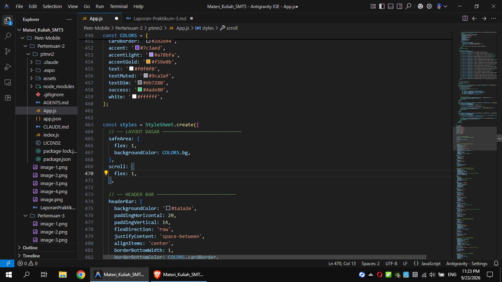

### 11.3 Konfirmasi Bukti Header Bar

Menampilkan pengaturan style untuk bagian header aplikasi.
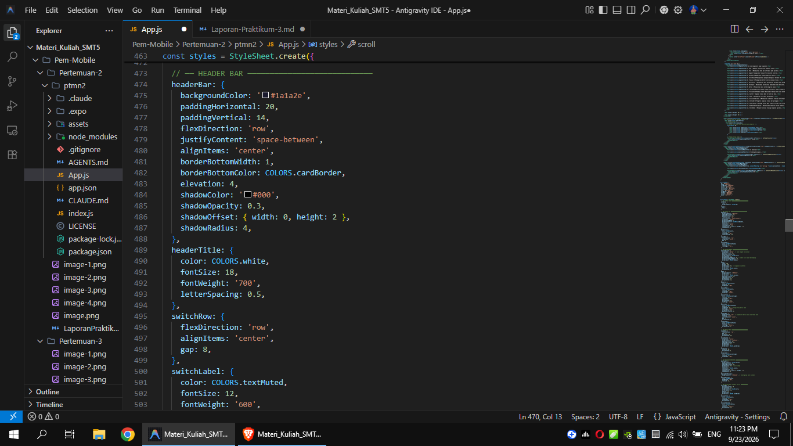

### 11.4 Konfirmasi Bukti Section Profil

Menampilkan pengaturan style untuk foto, nama, informasi profil, dan bagian kontak.
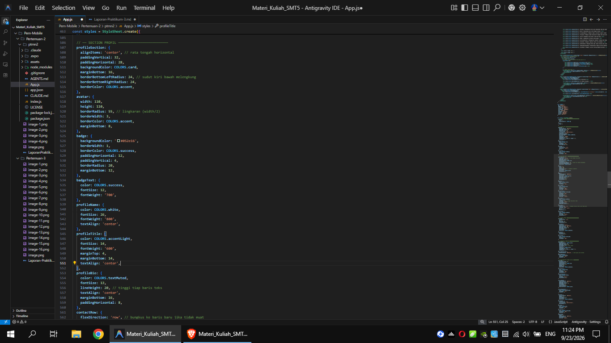

### 11.5 Konfirmasi Bukti Sosial Media

Menampilkan pengaturan style untuk tombol media sosial.
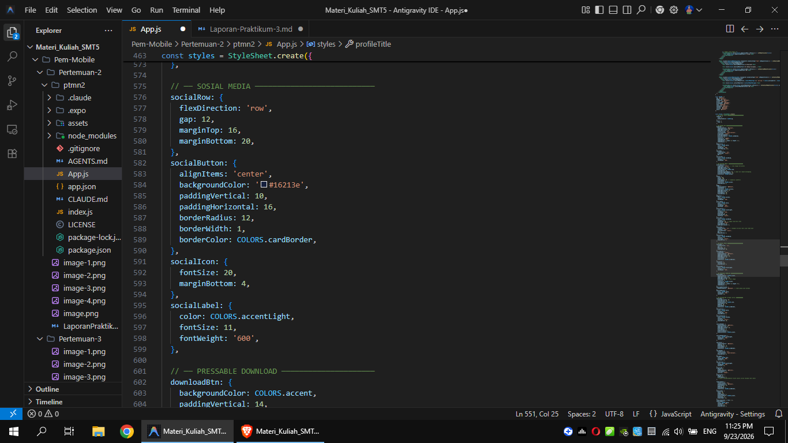

### 11.6 Konfirmasi Bukti Tombol Download

Menampilkan pengaturan style untuk tombol **Download CV** dan efek saat tombol ditekan.
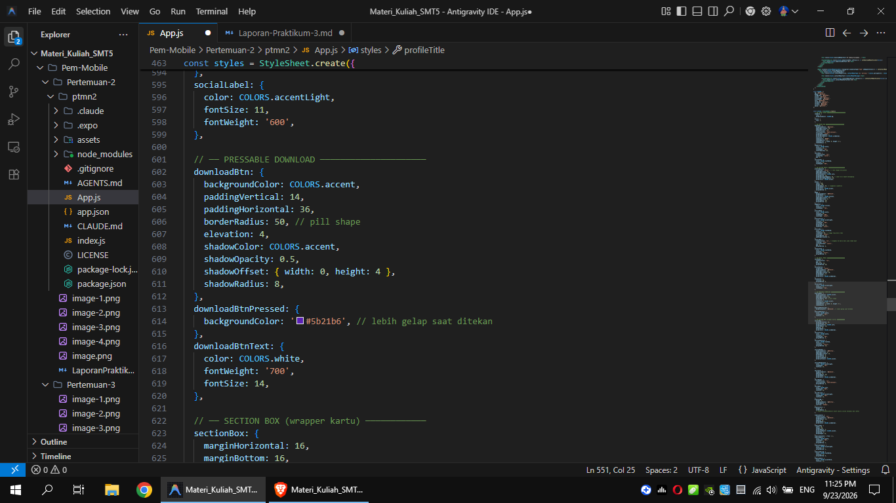

### 11.7 Konfirmasi Bukti Section Box

Menampilkan pengaturan style untuk wrapper atau kartu pada setiap section.
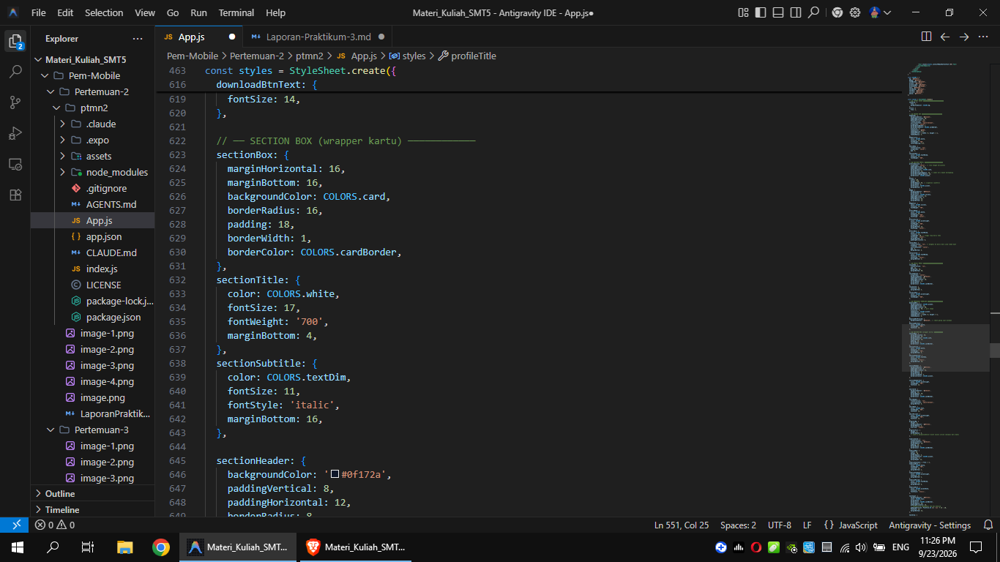

### 11.8 Konfirmasi Bukti Section List Header

Menampilkan pengaturan style untuk header kategori pada `SectionList`.
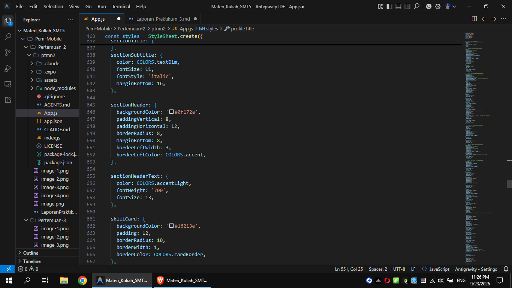

### 11.9 Konfirmasi Bukti Skill Card

Menampilkan pengaturan style untuk kartu skill dan progress bar.
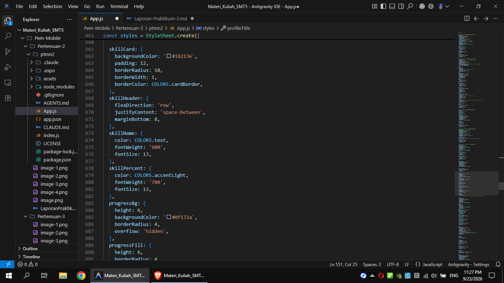

### 11.10 Konfirmasi Bukti Timeline Card

Menampilkan pengaturan style untuk kartu pengalaman dan pendidikan.
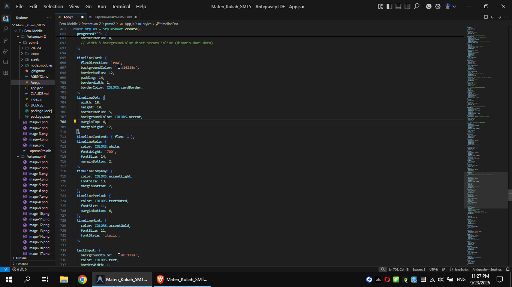

### 11.11 Konfirmasi Bukti Text Input

Menampilkan pengaturan style untuk input nama dan pesan pada form kontak.
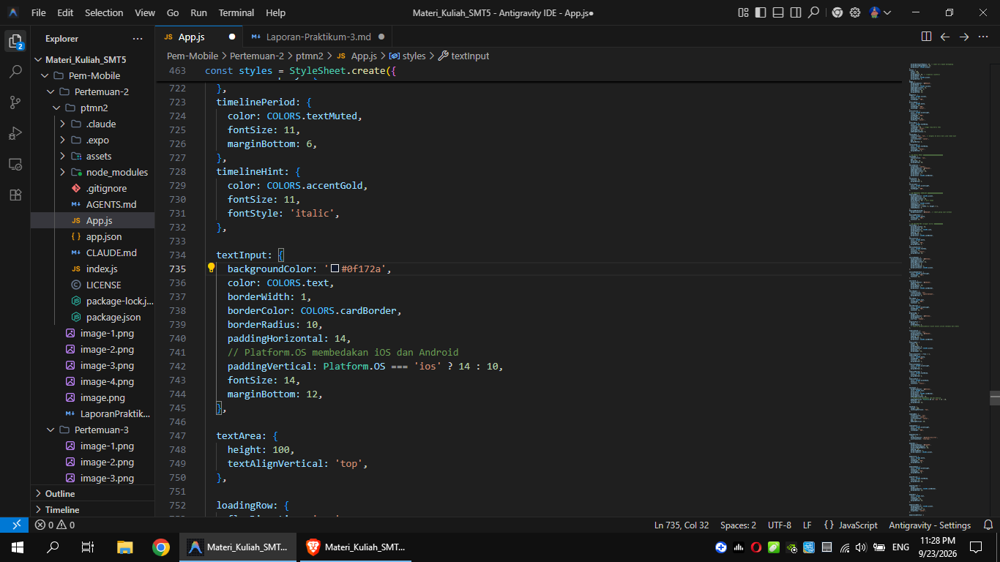

### 11.12 Konfirmasi Bukti Loading Row

Menampilkan pengaturan style untuk bagian indikator loading saat pesan dikirim.
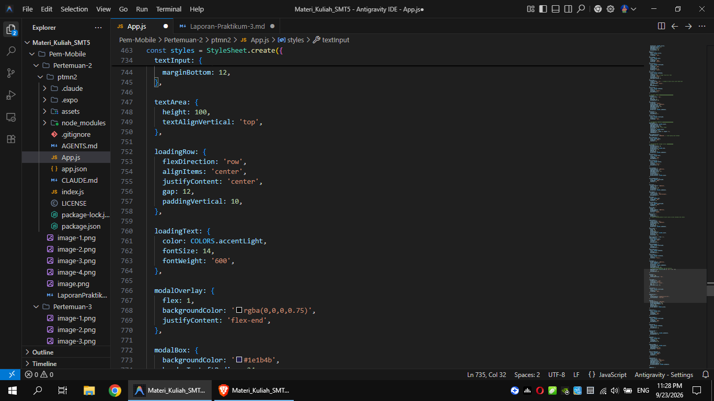

### 11.13 Konfirmasi Bukti Modal

Menampilkan pengaturan style untuk popup detail riwayat dan tombol Tutup.
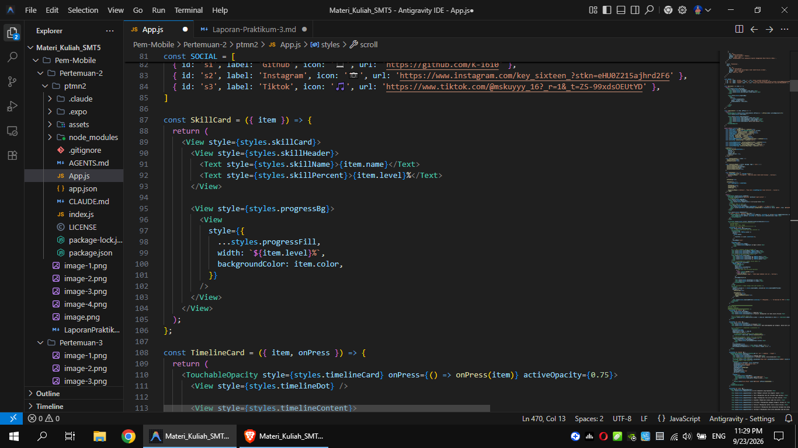

## Langkah 12 : Verifikasi dan Pengujian

1. Menjalankan aplikasi untuk memastikan seluruh tampilan dapat ditampilkan tanpa error.
2. Memastikan foto profil dapat dimuat.
3. Menguji fungsi scroll pada halaman.
4. Menguji `Switch` pada bagian **Open to Work**.
5. Menguji progress bar pada daftar skills.
6. Menekan kartu riwayat untuk menampilkan modal.
7. Menekan tombol **Tutup** untuk menutup modal.
8. Mengisi form kontak dan mengirimkan pesan.
9. Menguji form ketika input masih kosong.
10. Menguji tombol **Download CV**.
11. Menguji tombol sosial media.
12. **Konfirmasi Bukti**
Menampilkan hasil akhir aplikasi setelah seluruh komponen dan fitur berhasil diterapkan.
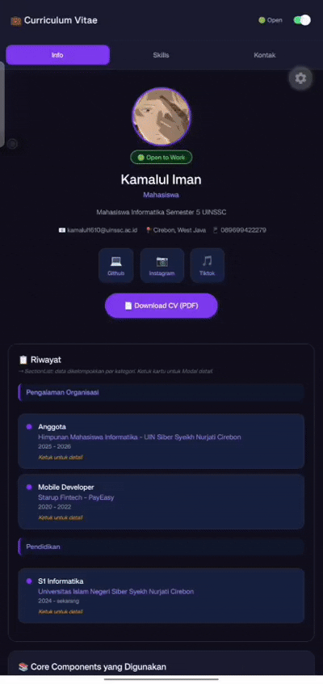
