# Laporan Praktikum Pemrograman Mobile Pertemuan 4 #

### Implementasi Navigasi (Stack, Tab, dan Drawer) di React Native ###

## 🎯 Tujuan Pembelajaran

Setelah menyelesaikan praktikum ini, mahasiswa diharapkan mampu:

1. Memahami konsep dan mekanisme perpindahan layar (*routing*) pada aplikasi *mobile*.
2. Melakukan instalasi dan konfigurasi pustaka **React Navigation**.
3. Mengimplementasikan **Stack Navigation** untuk alur layar linier.
4. Mengimplementasikan **Bottom Tab Navigation** untuk menu pintasan bawah.
5. Mengimplementasikan **Drawer Navigation** untuk menu panel samping (*sidebar*).
6. Menggabungkan berbagai jenis navigasi (*Nested Navigation*).

## Langkah 1 : Persiapan Project dan Instalasi Pustaka

1. Membuat *project* Expo baru bernama `ptmn4` melalui terminal.
2. Menginstal pustaka inti navigasi dengan perintah `npm install @react-navigation/native`.
3. **Konfirmasi Bukti**
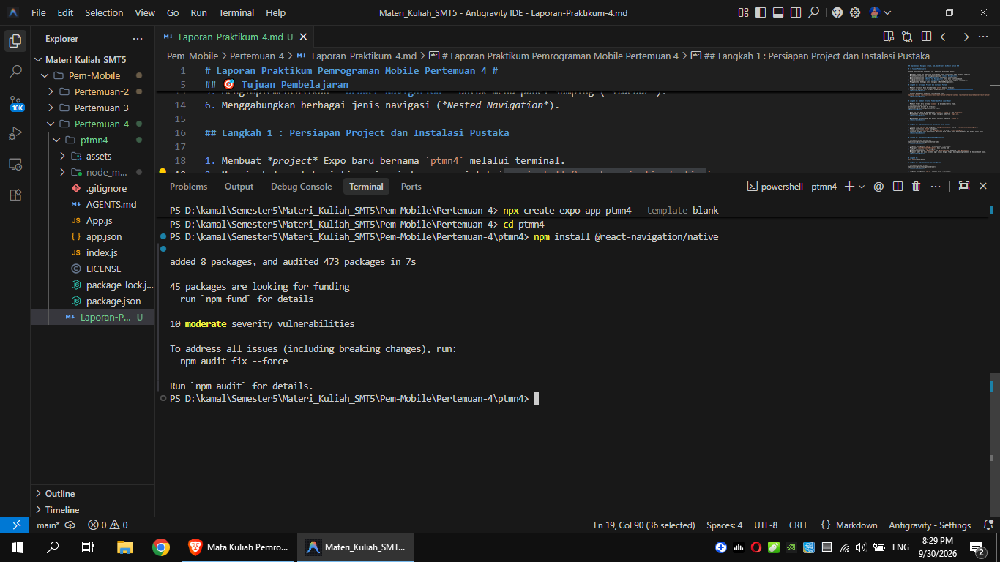
4. Install dependensi pendukung (wajib untuk Expo)
`npx expo install react-native-screens react-native-safe-area-context react-native-gesture-handler react-native-reanimated`
5. **Konfirmasi Bukti**
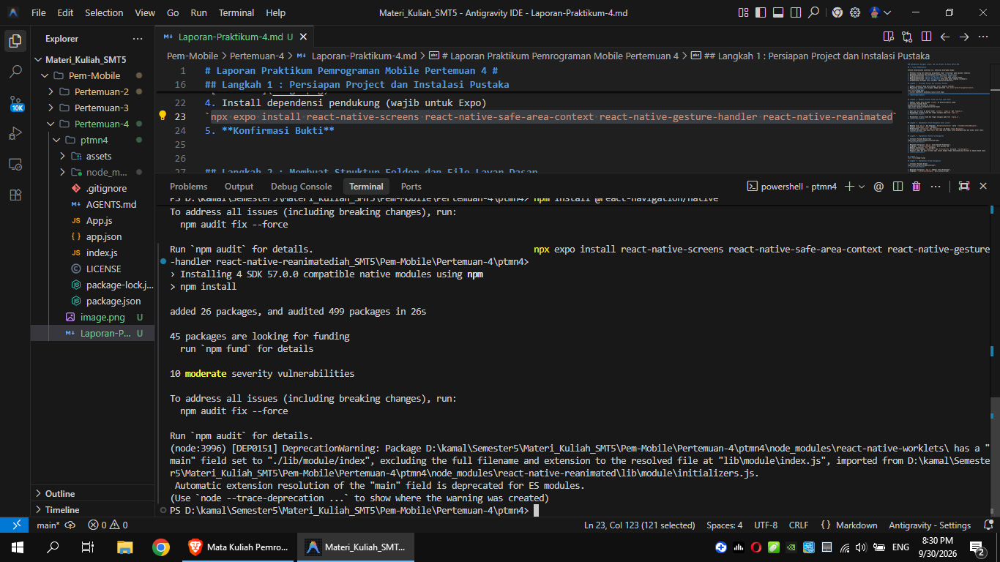

## Langkah 2 : Membuat Struktur Folder dan File Layar Dasar

2. Membuat folder baru bernama `screens` di dalam direktori utama.
3. Instalasi Pustaka Stack
Jalankan perintah berikut di terminal:
`npm install @react-navigation/native-stack`
**Konfirmasi Bukti**
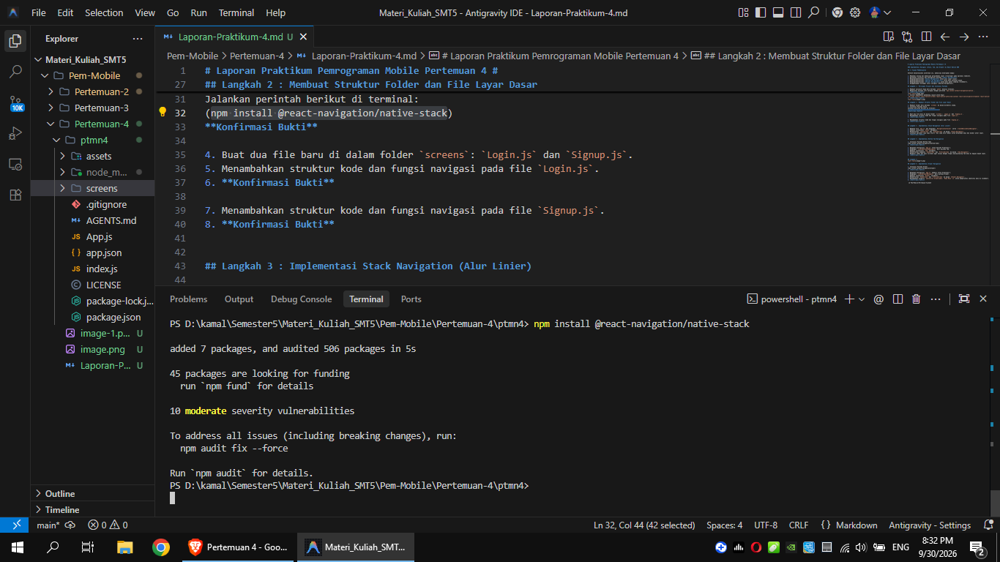
4. Buat dua file baru di dalam folder `screens`: `Login.js` dan `Signup.js`.
5. Menambahkan struktur kode dan fungsi navigasi pada file `Login.js`.
6. **Konfirmasi Bukti**
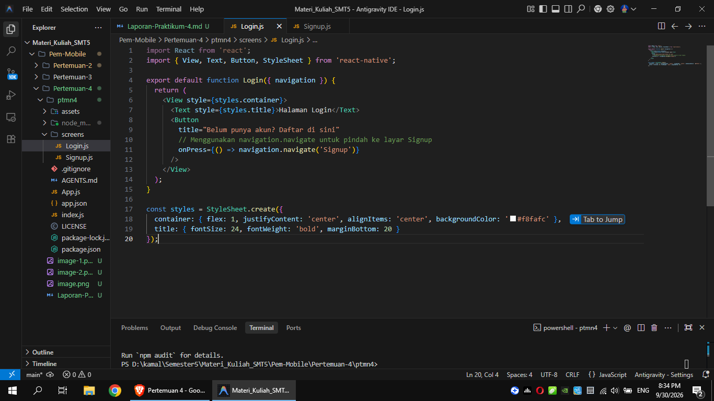
7. Menambahkan struktur kode dan fungsi navigasi pada file `Signup.js`.
8. **Konfirmasi Bukti**
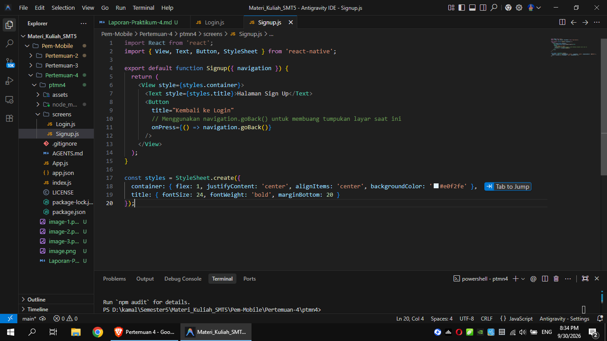

## Langkah 3 : Implementasi Stack Navigation (Alur Linier)

1. Membuka file `App.js` dan mengimpor `NavigationContainer` serta `createNativeStackNavigator`.
2. Membuat instansiasi `Stack` navigator.
3. Mendaftarkan `LoginScreen` dan `SignupScreen` ke dalam `<Stack.Navigator>`.
4. Jalankan aplikasi `npx expo start`. Uji coba klik tombol untuk berpindah maju dan mundur antar layar.
5. **Konfirmasi Bukti**
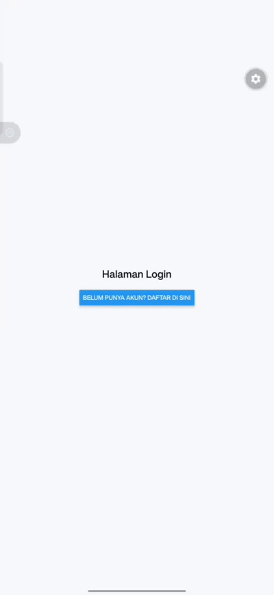

## Langkah 4 : Implementasi Bottom Tab Navigation

1. Instalasi Pustaka Bottom Tabs
`npm install @react-navigation/bottom-tabs`
2. **Konfirmasi Bukti**
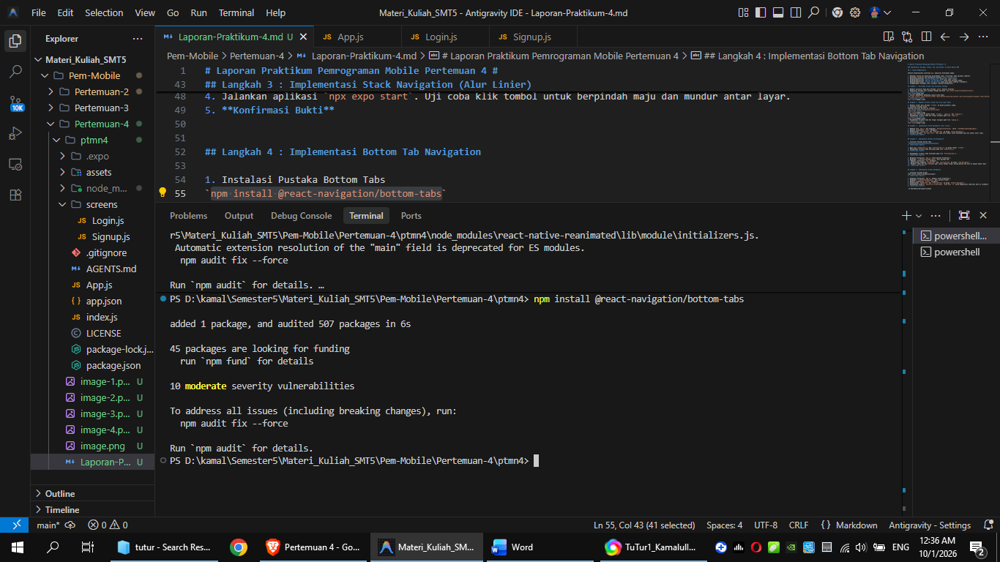
3. Buat file `HomeScreen.js` dan `ProfileScreen.js` di dalam folder `screens`.
4. Menambahkan struktur kode antarmuka pada file `HomeScreen.js`.
5. **Konfirmasi Bukti**
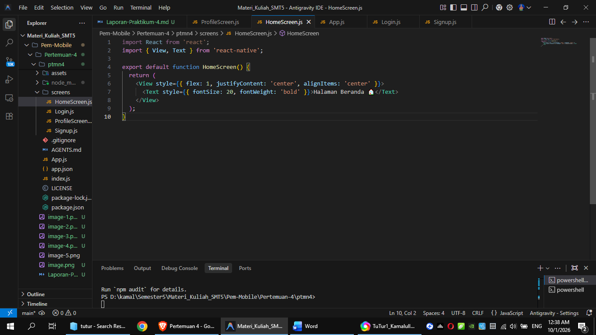
6. Menambahkan struktur kode antarmuka pada file `ProfileScreen.js`.
7. **Konfirmasi Bukti**
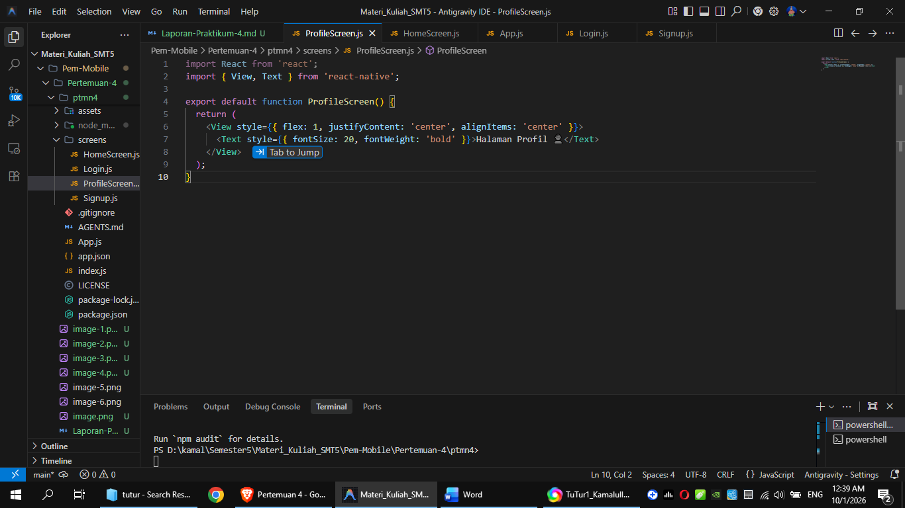
8. Mengubah konfigurasi `App.js` untuk mencoba Praktikum 2.
9. Mengimpor `createBottomTabNavigator` dari pustaka Tab.
10. Membuat instansiasi `Tab` navigator.
11. Mendaftarkan komponen `HomeScreen` dan `ProfileScreen` ke dalam `<Tab.Navigator>`.
12. Mengatur label dan opsi *screen* agar sesuai dengan fungsi masing-masing tab menu di bagian bawah layar.
13. **Konfirmasi Bukti**
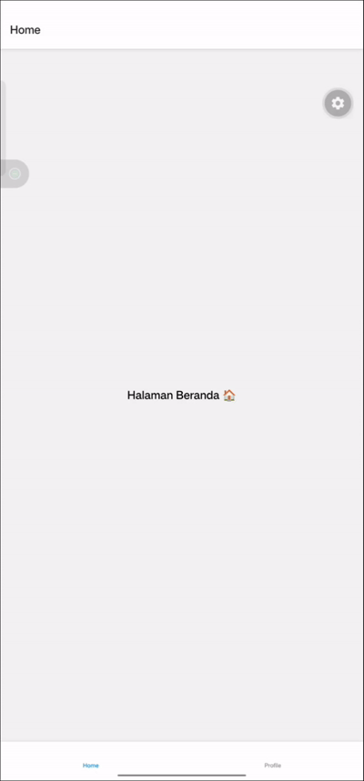

## Langkah 5 : Implementasi Drawer Navigation

1. Instalasi Pustaka Drawer
`npm install @react-navigation/drawer`
2. **Konfirmasi Bukti**
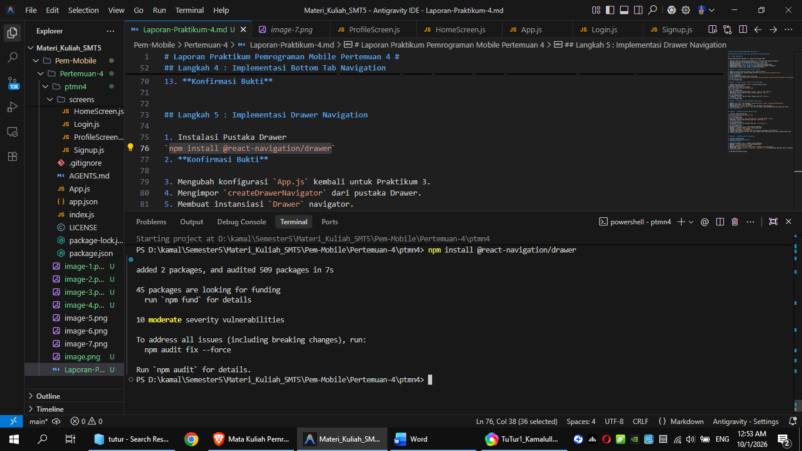
3. Mengubah konfigurasi `App.js` kembali untuk Praktikum 3.
4. Mengimpor `createDrawerNavigator` dari pustaka Drawer.
5. Membuat instansiasi `Drawer` navigator.
6. Mendaftarkan `HomeScreen` dan `ProfileScreen` ke dalam `<Drawer.Navigator>`.
7. Menambahkan properti `options={{ drawerLabel: 'Nama Menu' }}` untuk memperjelas identitas menu di *sidebar*.
8. **Konfirmasi Bukti**
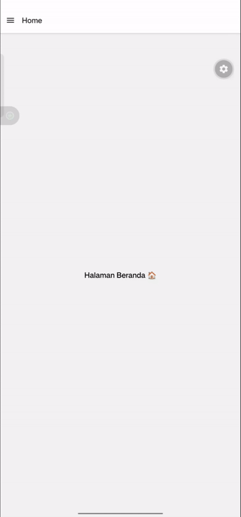